# Proyecto de API

Este proyecto contiene funciones automatizadas para gestionar la API.

## Diagrama de Infraestructura

```mermaid
graph TD;
    mongodbatlas_project --> AWS
    mongodbatlas_cluster --> AWS
    mongodbatlas_database_user --> AWS
    aws_s3_bucket --> AWS
    aws_s3_bucket_website_configuration --> AWS
    aws_s3_bucket_public_access_block --> AWS
    aws_s3_bucket_policy --> AWS
    grafana_cloud_stack --> AWS
    aws_apigatewayv2_api --> AWS
    aws_apigatewayv2_stage --> AWS
    aws_apigatewayv2_route --> AWS
    aws_apigatewayv2_integration --> AWS
    aws_s3_bucket --> AWS
    aws_s3_bucket_website_configuration --> AWS
    aws_s3_bucket_public_access_block --> AWS
    aws_s3_bucket_policy --> AWS
```

## Recursos Utilizados
- EC2
- MongoDB
- Grafana
- Aplicaciones Web y Móviles
- API Backend
