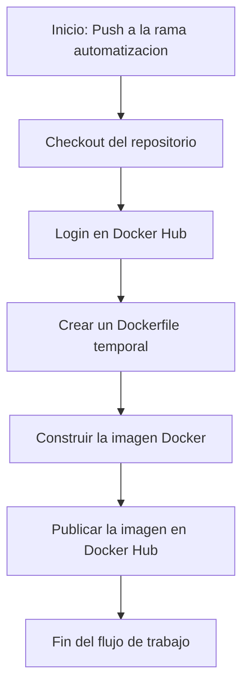

# Documentación del Proyecto

Este repositorio contiene la documentación y los detalles del proyecto relacionado con la automatización y el desarrollo de APIs utilizando Docker. El proyecto es parte de los Juegos Florales de la Universidad Privada de Tacna (UPT) y corresponde al curso de "Tópicos de Base de Datos Avanzados I".

## Repositorios de Docker

A continuación, se presentan los enlaces a los repositorios de Docker relacionados con este proyecto:

1. **Proyecto SI8811A 2024-II U1 - APIs y Funciones Meza y Churacutipa**  
   [Repositorio Docker: proyecto-si8811a-2024-ii-u1-apis-y-funciones-meza-y-churacutipa](https://hub.docker.com/r/palbertt/proyecto-si8811a-2024-ii-u1-apis-y-funciones-meza-y-churacutipa)

2. **Proyecto SI8811A 2024-II U1 - APIs y Funciones Jarro y Valle**  
   [Repositorio Docker: proyecto-si8811a-2024-ii-u1-apis-y-funciones-jarro-y-valle](https://hub.docker.com/r/palbertt/proyecto-si8811a-2024-ii-u1-apis-y-funciones-jarro-y-valle)

3. **Proyecto SI8811A 2024-II U1 - API y Funciones Zevallos y Anahua**  
   [Repositorio Docker: proyecto-si8811a-2024-ii-u1-api-y-funciones-zevallos-y-anahua](https://hub.docker.com/r/palbertt/proyecto-si8811a-2024-ii-u1-api-y-funciones-zevallos-y-anahua)

4. **Automatización**  
   [Repositorio Docker: Automatización](https://hub.docker.com/r/palbertt/automatizacion)

5. **Proyecto SI8811A 2024-II U1 - Pruebas Cano y Valverde**  
   [Repositorio Docker: proyecto-si8811a-2024-ii-u1-pruebas-cano-valverde](https://hub.docker.com/r/palbertt/proyecto-si8811a-2024-ii-u1-pruebas-cano-valverde)

6. **Desarrollo de API Back**  
   [Repositorio Docker: proyecto-si8811a-2024-ii-u1-desarrollo-api-back](https://hub.docker.com/r/palbertt/proyecto-si8811a-2024-ii-u1-desarrollo-api-back)

## Flujo del Trabajo

El siguiente diagrama ilustra el proceso automatizado para realizar el push de las imágenes de Docker a Docker Hub. Este flujo es parte del CI/CD implementado con GitHub Actions:

## Descripción de las Ramas

Cada rama tiene un propósito específico en el proyecto y está diseñada para facilitar la organización del trabajo y la implementación de diferentes funcionalidades.

- **ApiFuncion**: Esta rama está orientada al desarrollo del CI/CD Pipeline para la API creada con .NET. Se configura para automatizar el proceso de integración y despliegue continuo, utilizando GitHub Actions para construir y enviar la imagen Docker a Docker Hub.

- **ApiFunciones**: En esta rama se enfoca en la automatización del despliegue de una API relacionada con la gestión de lugares. Utiliza GitHub Actions y Docker para la automatización, garantizando que cualquier cambio realizado en el código se despliegue automáticamente en el contenedor.

- **DesarolloApiBack**: Designada por Helbert, esta rama se utiliza para diseñar y documentar la infraestructura del proyecto, incluyendo diagramas y esquemas. Es el espacio donde se desarrollan mejoras en la arquitectura del backend y se prueban nuevas configuraciones.

- **Automatizacion**: En esta rama se implementan pruebas de automatización, asegurando que las configuraciones de los pipelines y las tareas automatizadas funcionen correctamente. Es el entorno principal para experimentar con nuevas estrategias de automatización antes de integrarlas al flujo principal.

## Tecnologías Usadas

El proyecto utiliza las siguientes tecnologías:

- **Docker Hub**
- **GitHub Actions**
- **Terraform**
- **.NET**

Cada una de estas tecnologías juega un papel importante en la automatización, despliegue y gestión de la infraestructura del proyecto.
