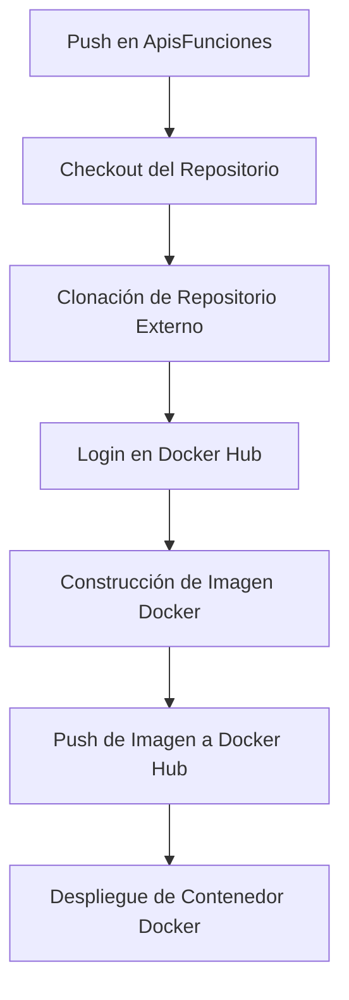
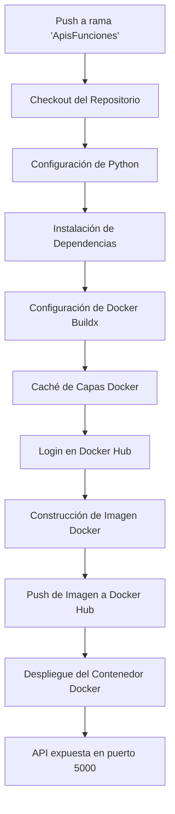
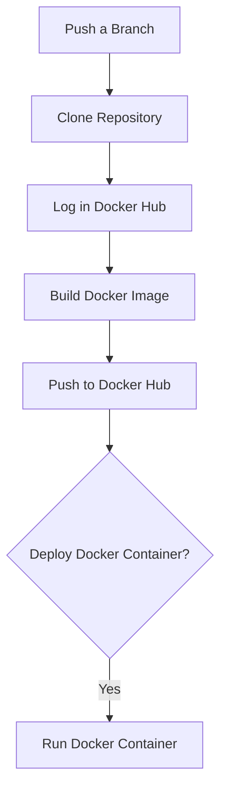

[](https://classroom.github.com/a/vK6WBQ1t)
[](https://classroom.github.com/open-in-codespaces?assignment_repo_id=15560953)

# Automatización de Despliegue de API de Lugares con GitHub Actions y Docker

## Descripción del Proyecto

Este proyecto automatiza el despliegue de una API de lugares utilizando GitHub Actions y Docker. El flujo de trabajo se activa automáticamente en cada `push` en la rama `ApisFunciones`, y realiza tareas como la construcción de imágenes Docker, la autenticación en Docker Hub y el despliegue de contenedores.

## Tecnologías Utilizadas

- **GitHub Actions**: Integración continua y despliegue continuo (CI/CD).
- **Docker**: Contenerización de aplicaciones.
- **Docker Hub**: Almacenamiento de imágenes Docker.

## Flujo de Trabajo Automatizado

### Diagrama de Flujo de Trabajo - Archivo YAML 1


### Pasos del Flujo de Trabajo

1. **Checkout del Repositorio**:
   - Clona el código del repositorio actual.
   
2. **Clonación del Repositorio Externo**:
   - Clona un repositorio externo que contiene el código de la API de lugares.
   - Comando:
     ```bash
     git clone --single-branch --branch Desarrollo https://github.com/UPT-FAING-EPIS/proyecto-si8811a-2024-ii-u1-api-y-funciones-zevallos-y-anahua.git external-repo
     ```

3. **Login en Docker Hub**:
   - Se utiliza la acción de inicio de sesión para Docker Hub utilizando las credenciales almacenadas en secretos de GitHub.
   - Configuración:
     ```yaml
     - name: Log in to Docker Hub
       uses: docker/login-action@v2
       with:
         username: ${{ secrets.DOCKER_HUB_USERNAME }}
         password: ${{ secrets.DOCKER_HUB_ACCESS_TOKEN }}
     ```

4. **Construcción y Push de la Imagen Docker**:
   - Se construye la imagen Docker de la API y se sube a Docker Hub.
   - Configuración:
     ```yaml
     - name: Build and push Docker image
       uses: docker/build-push-action@v4
       with:
         context: ./external-repo/api_lugares
         file: Dockerfile
         push: true
         tags: palbertt/automatizacion:api2-v1.0.0
     ```

5. **Despliegue del Contenedor Docker**:
   - Se ejecuta el contenedor de la API en segundo plano.
   - Comando:
     ```bash
     docker run -d -p 5000:5000 palbertt/automatizacion:api2-v1.0.0
     ```

### Archivo YAML - GitHub Actions

```yaml
name: Deploy External API-zevallos-y-anahua

on:
  push:
    branches:
      - ApisFunciones

jobs:
  build:
    runs-on: ubuntu-latest

    steps:
      - name: Checkout repository
        uses: actions/checkout@v3

      - name: Clone external repository (Desarrollo branch)
        run: git clone --single-branch --branch Desarrollo https://github.com/UPT-FAING-EPIS/proyecto-si8811a-2024-ii-u1-api-y-funciones-zevallos-y-anahua.git external-repo

      - name: Log in to Docker Hub
        uses: docker/login-action@v2
        with:
          username: ${{ secrets.DOCKER_HUB_USERNAME }}
          password: ${{ secrets.DOCKER_HUB_ACCESS_TOKEN }}

      - name: Build and push Docker image
        uses: docker/build-push-action@v4
        with:
          context: ./external-repo/api_lugares
          file: Dockerfile
          push: true
          tags: palbertt/automatizacion:api2-v1.0.0

      - name: Deploy Docker Container
        run: |
          docker run -d -p 5000:5000 palbertt/automatizacion:api2-v1.0.0
```

[](https://classroom.github.com/a/vK6WBQ1t)
[](https://classroom.github.com/open-in-codespaces?assignment_repo_id=15560953)

# CI/CD Pipeline para Automatización de API de Lugares

## Descripción

Este proyecto implementa un pipeline de CI/CD que automatiza la construcción y despliegue de una API de lugares utilizando **GitHub Actions** y **Docker**. El pipeline realiza tareas como la construcción de imágenes Docker, la instalación de dependencias de Python, y el despliegue automático del contenedor.

## Tecnologías Utilizadas

- **GitHub Actions**: Automatización de CI/CD.
- **Docker**: Contenerización de la aplicación.
- **Docker Hub**: Almacenamiento de imágenes Docker.
- **Python**: Lenguaje de programación y manejo de dependencias.

## Flujo de Trabajo Automatizado

### Diagrama de Flujo de Trabajo - Archivo YAML 2



### Activación del Flujo de Trabajo

El pipeline se activa automáticamente cuando se realiza un `push` en la rama `ApisFunciones`.

### Paso a Paso del Flujo de Trabajo

1. **Clonación del Repositorio Actual**:
   - El repositorio principal se clona desde la rama `desarrollo` para obtener el código actualizado.

2. **Configuración del Entorno Python**:
   - Se configura Python en el runner de GitHub para asegurar que todas las dependencias requeridas estén instaladas correctamente.

3. **Instalación de Dependencias**:
   - `pip` instala todas las dependencias del proyecto listadas en `requirements.txt`.

4. **Configuración de Docker Buildx**:
   - Se configura Docker Buildx para habilitar construcciones multiplataforma y cacheo avanzado de capas.

5. **Caché de Capas de Docker**:
   - Se almacena la caché de las capas de Docker para acelerar construcciones futuras.

6. **Login en Docker Hub**:
   - Se realiza la autenticación en Docker Hub usando las credenciales de usuario almacenadas como secretos en GitHub.

7. **Construcción y Push de la Imagen Docker**:
   - La imagen Docker se construye y se sube automáticamente a Docker Hub con la etiqueta especificada.

8. **Despliegue del Contenedor Docker**:
   - El contenedor Docker se despliega en segundo plano y la API se expone en el puerto 5000.

### Archivo YAML - GitHub Actions

Este es el archivo YAML completo que configura el flujo de trabajo para CI/CD:

```yaml
name: CI/CD Pipeline

on:
  push:
    branches:
      - ApisFunciones  # Cambia esto según la rama correcta que uses

jobs:
  build:
    runs-on: ubuntu-latest  # El trabajo se ejecuta en un runner de Ubuntu

    steps:
    - name: Checkout current repository  # Clona el repositorio actual
      uses: actions/checkout@v3
      with:
        repository: UPT-FAING-EPIS/proyecto-si8811a-2024-ii-u1-apis-y-funciones-meza-y-churacutipa  # Especifica el repositorio
        ref: desarrollo  # Rama de la cual se hace checkout

    - name: Set up Python  # Configuración del entorno Python
      uses: actions/setup-python@v4
      with:
        python-version: 3.12  # Versión de Python utilizada en el Dockerfile

    - name: Install dependencies  # Instalación de dependencias del proyecto
      run: |
        python -m pip install --upgrade pip  # Actualiza pip
        pip install -r requirements.txt  # Instala las dependencias desde requirements.txt

    - name: Set up Docker Buildx  # Configuración de Docker Buildx
      uses: docker/setup-buildx-action@v2

    - name: Cache Docker layers  # Habilita caché para las capas de Docker
      uses: actions/cache@v3
      with:
        path: /tmp/.buildx-cache  # Ruta para almacenar la caché
        key: ${{ runner.os }}-docker-${{ github.sha }}  # Clave única para identificar la caché
        restore-keys: |
          ${{ runner.os }}-docker-  # Claves para restaurar la caché si está disponible

    - name: Log in to Docker Hub  # Autenticación en Docker Hub
      uses: docker/login-action@v2
      with:
        username: ${{ secrets.DOCKER_HUB_USERNAME }}  # Usuario de Docker Hub almacenado en secretos
        password: ${{ secrets.DOCKER_HUB_ACCESS_TOKEN }}  # Token de acceso de Docker Hub almacenado en secretos

    - name: Build and push Docker image  # Construcción y push de la imagen Docker
      uses: docker/build-push-action@v4
      with:
        context: .  # Contexto de la construcción (repositorio actual)
        file: Dockerfile  # Especifica el Dockerfile para construir la imagen
        push: true  # La imagen se sube a Docker Hub
        tags: palbertt/automatizacion:api1-v1.0.0  # Etiqueta de la imagen

    - name: Deploy Docker Container  # Despliegue del contenedor Docker
      run: |
        docker run -d -p 5000:5000 palbertt/automatizacion:api1-v1.0.0  # Despliega el contenedor y lo expone en el puerto 5000
```

# CI/CD Pipeline - Proyecto SI8811A 2024-II U1 Apis y Funciones

Este repositorio contiene un pipeline de **CI/CD** automatizado, que gestiona la construcción, envío y despliegue de imágenes Docker para el proyecto. Este pipeline está configurado para activarse cuando se realiza un **push** en la rama `ApisFunciones`. Utiliza **GitHub Actions** para ejecutar los pasos necesarios que aseguran que la imagen Docker se construya correctamente y se almacene en Docker Hub, lista para ser utilizada o desplegada en un servidor.

## Tecnologías Usadas

- **GitHub Actions**: Plataforma de automatización para gestionar y ejecutar los flujos de trabajo CI/CD.
- **Docker**: Tecnología de contenedorización para empaquetar aplicaciones y sus dependencias en contenedores.
- **Docker Hub**: Repositorio de imágenes Docker donde se almacena y comparte la imagen construida.
- **Ubuntu**: Sistema operativo base para ejecutar los flujos de trabajo.
- **Git**: Sistema de control de versiones para gestionar el código fuente.

## Flujo de Trabajo Automatizado

1. **Commit en la rama `ApisFunciones`**: Al hacer un push a la rama, se activa el pipeline.
2. **Clonación del repositorio**: El pipeline clona el repositorio y accede al código fuente.
3. **Inicio de sesión en Docker Hub**: Se autentica en Docker Hub usando las credenciales almacenadas como secretos en GitHub.
4. **Construcción de la imagen Docker**: Se construye una imagen a partir del `Dockerfile`.
5. **Envío de la imagen a Docker Hub**: La imagen se envía al repositorio de Docker Hub con la etiqueta `latest`.
6. **Despliegue opcional del contenedor**: Se ejecuta el contenedor Docker utilizando la imagen subida.

## Diagrama de Flujo de Trabajo


### Archivo YAML - GitHub Actions

Este es el archivo YAML completo que configura el flujo de trabajo para CI/CD:

```yaml
name: CI/CD Pipeline

on:
  push:
    branches:
      - ApisFunciones  # Cambia esto según la rama correcta que uses

jobs:
  build:
    runs-on: ubuntu-latest

    steps:
    - name: Checkout current repository
      uses: actions/checkout@v3
      with:
        repository: UPT-FAING-EPIS/proyecto-si8811a-2024-ii-u1-apis-y-funciones-jarro-y-valle
        ref: develop

    # Paso para iniciar sesión en Docker Hub
    - name: Log in to Docker Hub
      uses: docker/login-action@v2
      with:
        username: ${{ secrets.DOCKER_HUB_USERNAME }}  # Añade tu nombre de usuario de Docker Hub en los secretos de GitHub
        password: ${{ secrets.DOCKER_HUB_ACCESS_TOKEN }}  # Añade el token de acceso de Docker Hub como secreto

    # Construir y empujar la imagen a Docker Hub
    - name: Build and push Docker image
      uses: docker/build-push-action@v4
      with:
        context: .  # El contexto es el directorio raíz del repo donde está tu Dockerfile
        file: ./Dockerfile  # Asegúrate de que el Dockerfile esté en el directorio raíz
        push: true
        tags: palbertt/proyecto-si8811a-2024-ii-u1-apis-y-funciones-jarro-y-valle:latest

    # (Opcional) Desplegar el contenedor en un servidor
    - name: Deploy Docker Container (optional)
      run: |
        docker run -d -p 8080:8080 palbertt/proyecto-si8811a-2024-ii-u1-apis-y-funciones-jarro-y-valle:latest
```
