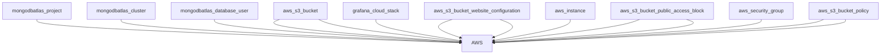

# DIAGRAMAS 

En esta rama se generan los diagramas de infraestructura del repositorio proyecto-si8811a-2024-ii-u1-desarrollo-api-back y develop, la rama donde están los archivos TF.

## Diagrama de Infraestructura


## Diagrama de Estructura de Archivos
```mermaid
graph TD;
    Root --> terraform_repo
    terraform_repo --> .git
    .git --> info
    .git --> branches
    .git --> logs
    logs --> refs
    refs --> remotes
    remotes --> origin
    refs --> heads
    .git --> hooks
    .git --> refs
    refs --> remotes
    remotes --> origin
    refs --> heads
    refs --> tags
    .git --> objects
    objects --> info
    objects --> 3c
    objects --> 0c
    objects --> 19
    objects --> f7
    objects --> da
    objects --> 60
    objects --> 74
    objects --> 5e
    objects --> 50
    objects --> d0
    objects --> eb
    objects --> pack
    objects --> 99
    objects --> 53
    objects --> 21
    objects --> 80
    objects --> e6
    objects --> 9b
    objects --> 56
    objects --> 15
    objects --> f2
    objects --> 0d
    objects --> ff
    objects --> f0
    objects --> de
    objects --> f4
    terraform_repo --> modules
    modules --> mongodb
    modules --> mobile_app
    modules --> grafana
    modules --> docker_host
    modules --> web_app
    terraform_repo --> ""graph.dot""
    terraform_repo --> "outputs.tf"
    terraform_repo --> "main.tf"
    terraform_repo --> "diagrama.drawio"
    .git --> "config"
    info --> "exclude"
    .git --> "description"
    .git --> "shallow"
    origin --> "develop"
    heads --> "develop"
    logs --> "HEAD"
    hooks --> "push-to-checkout.sample"
    hooks --> "pre-rebase.sample"
    hooks --> "post-update.sample"
    hooks --> "pre-applypatch.sample"
    hooks --> "fsmonitor-watchman.sample"
    hooks --> "sendemail-validate.sample"
    hooks --> "prepare-commit-msg.sample"
    hooks --> "update.sample"
    hooks --> "pre-commit.sample"
    hooks --> "pre-receive.sample"
    hooks --> "pre-push.sample"
    hooks --> "pre-merge-commit.sample"
    hooks --> "applypatch-msg.sample"
    hooks --> "commit-msg.sample"
    origin --> "develop"
    heads --> "develop"
    .git --> "index"
    3c --> "fb9d582fac49781ccb3e6967cd27667360bb0c"
    3c --> "d1b90689598bf1a847fb1110a3acdd3d5f678a"
    0c --> "ead1182fe4490d1dc80d1dbc3e82e159d30ac8"
    19 --> "98130a65e8f0bfc874ca1c3d5958ac94c3b598"
    f7 --> "918ae166ac54fdf98bf99cea09fe9cf3533e9e"
    da --> "8ed2bc72340ba7cefc3867f007d5f81b9a3032"
    60 --> "06670925f1b4d88bcf39876b4098c81ecedae7"
    74 --> "4b623461fa15a9815a2ad4e5a774c7b305b9c8"
    5e --> "530994fa852b48b1c0a7791f5000575012238c"
    5e --> "96c68cfa0a6c194b0bff63b88d8a689f1d0f3c"
    50 --> "57c9dd88be527c26099172050e71bb3e03a32a"
    d0 --> "806a5d3e3aaf2999cf9a3ead4a73fd414a28ce"
    eb --> "e00bb3bb7de77cde8cea1f16d0d50b21669a5d"
    99 --> "6f2f7d0b9ee9917205aa72077616c149e15aff"
    53 --> "2e5cc0588dec359896af1ba495354d128c8a7e"
    21 --> "280aa498e236d181789f1d071a8d8acf2c9f53"
    80 --> "de20b2302ba1391533d014ca2bf0922fea360c"
    e6 --> "9de29bb2d1d6434b8b29ae775ad8c2e48c5391"
    9b --> "bf54b484ef0293668496bb19ed808d2628b338"
    56 --> "9525bdb527de9d050a539220b60abb017a1890"
    15 --> "c4a99f0524ef2c00661f48cbe8160295888bf1"
    f2 --> "180d68bbeae7de85cb63afe2b84a648555fa68"
    0d --> "befb67f23c5964dcb4de15613b68b23b9d25e0"
    ff --> "b86cb69cff8a3cac7c8d909d40e98bf6e594e6"
    f0 --> "dfce682a22b1f08edcf9dcd9bde590b6c46f11"
    de --> "c90b4f061171af0988e71cc28e3a8db6c210d2"
    f4 --> "d1dc1e8348da5e1e6323d4765e24e3382841c6"
    .git --> "HEAD"
    .git --> "FETCH_HEAD"
    terraform_repo --> "README.md"
    terraform_repo --> "terraform.tfvars"
    terraform_repo --> "variables.tf"
    terraform_repo --> ".txt"
    mongodb --> "outputs.tf"
    mongodb --> "main.tf"
    mongodb --> "variables.tf"
    mobile_app --> "outputs.tf"
    mobile_app --> "main.tf"
    mobile_app --> "variables.tf"
    grafana --> "outputs.tf"
    grafana --> "main.tf"
    grafana --> "variables.tf"
    docker_host --> "outputs.tf"
    docker_host --> "main.tf"
    docker_host --> "variables.tf"
    web_app --> "outputs.tf"
    web_app --> "main.tf"
    web_app --> "variables.tf"
```

## Archivos Terraform Analizados

- terraform_repo/outputs.tf
- terraform_repo/main.tf
- terraform_repo/variables.tf
- terraform_repo/modules/mongodb/outputs.tf
- terraform_repo/modules/mongodb/main.tf
- terraform_repo/modules/mongodb/variables.tf
- terraform_repo/modules/mobile_app/outputs.tf
- terraform_repo/modules/mobile_app/main.tf
- terraform_repo/modules/mobile_app/variables.tf
- terraform_repo/modules/grafana/outputs.tf
- terraform_repo/modules/grafana/main.tf
- terraform_repo/modules/grafana/variables.tf
- terraform_repo/modules/docker_host/outputs.tf
- terraform_repo/modules/docker_host/main.tf
- terraform_repo/modules/docker_host/variables.tf
- terraform_repo/modules/web_app/outputs.tf
- terraform_repo/modules/web_app/main.tf
- terraform_repo/modules/web_app/variables.tf

## Recursos Utilizados
- EC2
- MongoDB
- Grafana
- Aplicaciones Web y Móviles
- API Backend
