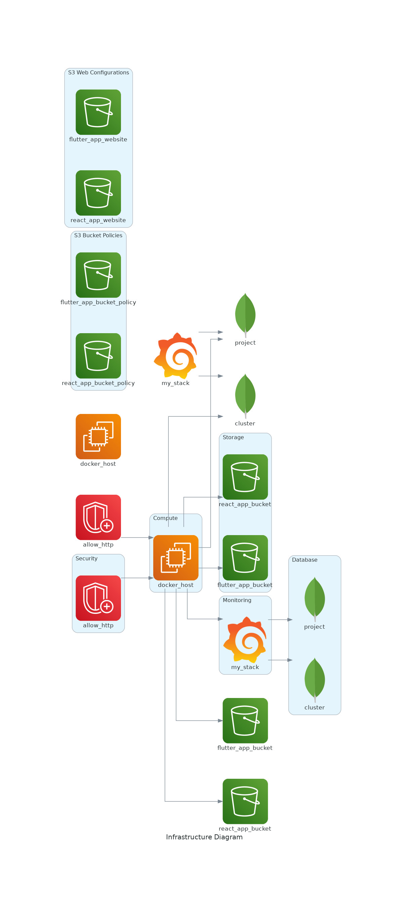

# DIAGRAMAS 

En esta rama se generan los diagramas de infraestructura del repositorio proyecto-si8811a-2024-ii-u1-desarrollo-api-back y develop, la rama donde están los archivos TF.

## Diagrama de Infraestructura

## Archivos Terraform Analizados
- terraform_repo/variables.tf
- terraform_repo/outputs.tf
- terraform_repo/modules/mongodb/variables.tf
- terraform_repo/modules/mongodb/outputs.tf
- terraform_repo/modules/grafana/variables.tf
- terraform_repo/modules/grafana/outputs.tf
- terraform_repo/modules/grafana/main.tf
- terraform_repo/modules/mobile_app/variables.tf
- terraform_repo/modules/mobile_app/outputs.tf
- terraform_repo/modules/docker_host/variables.tf
- terraform_repo/modules/docker_host/outputs.tf
- terraform_repo/modules/web_app/variables.tf
- terraform_repo/modules/web_app/outputs.tf
## Recursos Utilizados
- MongoDB
- Grafana
- Aplicaciones Web y Móviles
- API Backend
